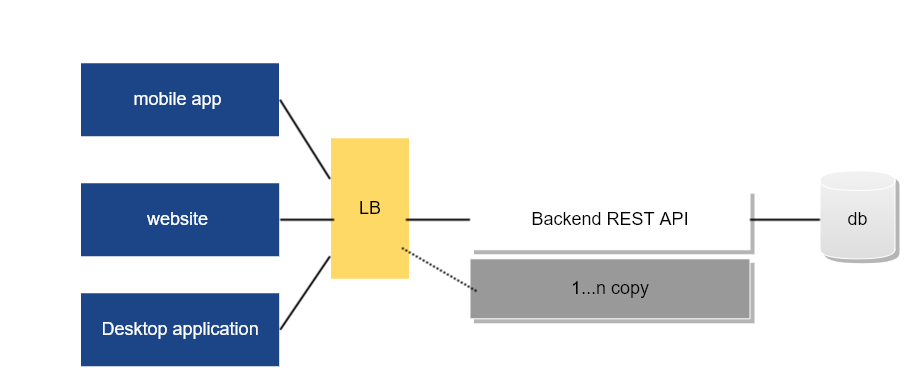
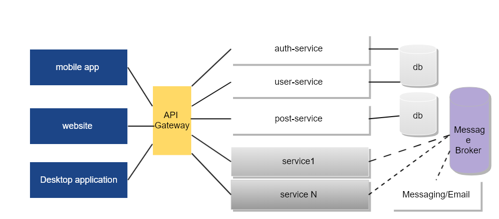
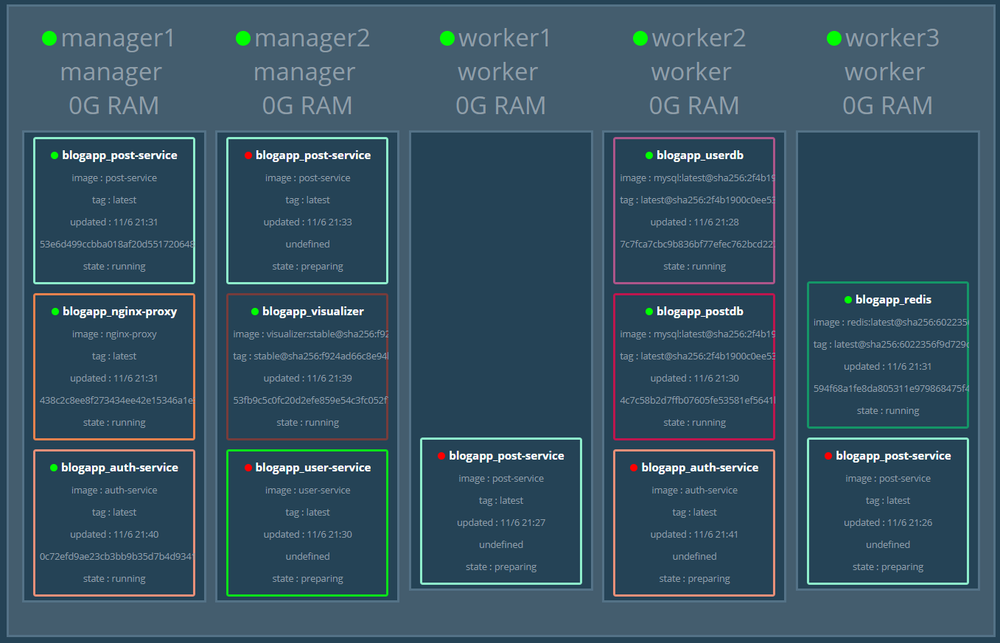

<!-- START doctoc generated TOC please keep comment here to allow auto update -->
<!-- DON'T EDIT THIS SECTION, INSTEAD RE-RUN doctoc TO UPDATE -->
**Table of Contents**  *generated with [DocToc](https://github.com/thlorenz/doctoc)*

- [Build a Microservice application with Spring Boot](#build-a-microservice-application-with-spring-boot)
  - [Prerequisites](#prerequisites)
    - [Setup local development environment](#setup-local-development-environment)
      - [Docker Toolbox Notes](#docker-toolbox-notes)
  - [Cook your first service](#cook-your-first-service)
    - [REST API overview](#rest-api-overview)
    - [Create domain models](#create-domain-models)
    - [Declare a `Repository` for `Post` entity](#declare-a-repository-for-post-entity)
    - [Create a domain service](#create-a-domain-service)
    - [Produces RESTful APIs](#produces-restful-apis)
    - [Exception Handling](#exception-handling)
    - [Miscellaneous](#miscellaneous)
  - [Secures microservice](#secures-microservice)
  - [Run the application locally](#run-the-application-locally)
  - [Run all services via Docker Compose](#run-all-services-via-docker-compose)
  - [Docker Swarm](#docker-swarm)

<!-- END doctoc generated TOC please keep comment here to allow auto update -->

# Build a Microservice application with Spring Boot

10 years ago, when we talked about the topic of application architecture, what we suddenly realized was 3-tiered applications and B/S architecture, which was the mainstream in that era. Today we have a word named it, **monolithic applications**.  

In the latest years, cloud based applications make mobile devices become the main clients instead of browsers in your personal computer. RESTful architecture is a good option to serve different clients.

*I have created a Spring based [RESTful application sample](https://github.com/hantsy/angularjs-springmvc-sample) and its [Spirng Boot variant](https://github.com/hantsy/angularjs-springmvc-sample-boot) to demonstrate how to build a  RESTful API based backend with Spring technology stack and a SPA frontend application with AngularJS.*

Compare to the traditional enterprise applications, RESTful architecture improves the the scalability by separating the backend RESTful API and frontend UI into different smaller applications. And the RESTful APIs provided in the backend can serve varied clients, such as frontend websites, a mobile applications, or third-party applications.

To improve the scalability of backend, just need to add one or more copies behind a load balance server. 



It is a really good start point for building modern applications. 

>NOTE: Although we are talking about Microservice in this post, I still suggest you start building your application with a monolithic RESTful backend and SPA based frontend UI if you know little about the complexity of Microservice. In the initial development stage, you have to spend lots of time on clarifying the problem domains, defining the bounded context etc, it is valuable when you are ready for migrating to Microservice architecture.

No doubt the above backend is still considered as a monolithic application. As time goes by, when the application becomes more complex, the backend will be problematic as you faced in the traditional 3-tiered applications.

* When apply a change, you have to redeploy the whole backend application even it is just a small fix.
* When you deploy multi copies of the backend applications behinds a load balance server, the transactional consistence will be a new challenge.
* The database itself will be a huge performance bottleneck when the concurrency of incoming requests is increasing. 

Microservice componentizes your application into small services(componentized applications), and make it more maintainable and scalable.  This demo application shows you how to build a Microservice application via Spring Boot. 



To demonstrate the Microservice architecture, we will reuse the models in my [RESTful application sample](https://github.com/hantsy/angularjs-springmvc-sample), and follow the **Bounded Context** concept of DDD(Domain Driven Design), break the backend monolithic application into three small services, including:

* **auth-service** is serving the operations of signin, signup and signout.
* **user-service** is responsible for user management.
* **post-service** exposes APIs for a simple CMS, including posts and comments.

Besides these, we use **nginx** as the **API Gateway**, which is just responsible for routing the incoming requests to downstream services. 

## Prerequisites

I assume you have some experience of Spring, and know well about the [REST convention](https://en.wikipedia.org/wiki/Representational_state_transfer), esp the [CHAPTER 5: Representational State Transfer (REST)](https://www.ics.uci.edu/~fielding/pubs/dissertation/rest_arch_style.htm) from Roy Fielding's dissertation: [Architectural Styles and
the Design of Network-based Software Architectures](https://www.ics.uci.edu/~fielding/pubs/dissertation/top.htm). 

And you have also installed the following software.

* [Oracle Java 8 SDK](https://java.oracle.com) 
* [Apache Maven](https://maven.apache.org)
* [Gradle](http://www.gradle.org) if you prefer Gradle as build tools
* Your favorite IDE, including :
  * [NetBeans IDE](http://www.netbeans.org)
  * [Eclipse IDE](http://www.eclipse.org) (or  Eclipse based IDE,  Spring ToolSuite is highly recommended) 
  * [Intellij IDEA](http://www.jetbrains.com)

This sample application is built on the newest Spring technology stack, including Spring Boot, Spring Data, Spring Security, etc. 

* Every small service is a Spring Boot application. Every service will be packaged as a **jar** file and use the embedded Tomcat as target runtime to serve the services.
* Every small service owns its database, eg. we use MySQL as the backing database for **auth-service**, and PostgreSQL for the **post-service**.
* Spring Data is used for simplifying data operations.
* Spring Session provides a simple strategy to generate and validate header based authentication token via sharing sessions in a backing session repository, in this sample we use Redis as session storage.
* Spring Security is responsible for protecting RESTful APIs.

Follow the 12 factors application guide, I suggest you use Docker in both development and production environment to make sure the same code base works well in different environments.

### Setup local development environment

Make sure you have installed the latest Docker, Docker Compose and Docker Machine, more info please refer to the installation guide from [Docker official website](https://www.docker.com).

>NOTE: I used the official Docker Toolbox in development stage under Windows 10, you can also used Docker for Windows instead.

Docker Compose allow you start up the dependent infrastructural services(such as Database etc) via a single `docker-compose` command.

```
docker-compose up
```

We will use MySQL, PostgreSQL and Redis in this demo, the following is a sample *docker-compose.yml* file.

```yaml
version: '3.3' # specify docker-compose version

services:    
  userdb:
    container_name: userdb
    image: mysql
    ports:
      - "3306:3306"
    environment:
      MYSQL_ROOT_PASSWORD: mysecret
      MYSQL_USER: user
      MYSQL_PASSWORD: password
      MYSQL_DATABASE: userdb
    volumes:
      - ./data/userdb:/var/lib/mysql
      
  postdb:
    container_name:  postdb
    image: postgres
    ports:
      - "5432:5432"
    restart: always
    environment:
      POSTGRES_PASSWORD: password
      POSTGRES_DB: postdb
    volumes:
      - ./data/postdb:/var/lib/postgresql     
      

  redis:
    container_name: redis
    image: redis
    ports:
      - "6379:6379"
```


#### Docker Toolbox Notes

If you are using Docker Toolbox, create a new machine for this project.

```
$ docker-machine create -d virtualbox --engine-registry-mirror https://docker.mirrors.ustc.edu.cn springms
```

>NOTE: The `--engine-registry-mirror https://docker.mirrors.ustc.edu.cn` will add a docker registry mirror setting in docker-machine specific *config.json*. For most of Chinese users, using a local mirror will speed up the Docker images downloading.

Then switch to the new created machine **springms**, and set the environment variables.

```
eval "$(docker-machine env springms)"
```

Forward the virtualbox ports to your local system, thus you can access the servers via `localhost` instead of the docker machine IP address.

```
 VBoxManage modifyvm "springms" --natpf1 "tcp-port3306,tcp,,3306,,3306"
 VBoxManage modifyvm "springms" --natpf1 "tcp-port3307,tcp,,3307,,3307"
 VBoxManage modifyvm "springms" --natpf1 "tcp-port5672,tcp,,5672,,5672"
 VBoxManage modifyvm "springms" --natpf1 "tcp-port15672,tcp,,15672,,15672"
 VBoxManage modifyvm "springms" --natpf1 "tcp-port6379,tcp,,6379,,6379"
 VBoxManage modifyvm "springms" --natpf1 "tcp-port27017,tcp,,27017,,27017"
```

Then run the dependent servers via `docker-compose` command line.

## Cook your first service

As an example, we build the **post-service** as the start point. 

With [Spring Initializr](https://start.spring.io), you can get a Spring Boot based project skeleton in seconds. 

Open your browser, go to [Spring Initializr](https://start.spring.io) page, fill the following essential fields for a project.

1. Choose **Java** as programming language.
2. Select the latest version of Spring Boot, **2.0.0.M7** is the latest milestone at the moment when I wrote this post.
3. Search and select the required facilities will be used in your project, such as **Web**, **Data JPA**, **Data Redis**, **Security**, **Session**, **Lombok** etc.
4. Set project name(maven artifact id) to **post-service**. 

Click **Generate Project** button or press **ALT+ENTER** keys to generate the project skeleton for downloading in your browser.

After downloading the generated archive, extract the files into your local disk and import it into your favorite IDE.

### REST API overview

Following the REST convention and HTTP protocol specification, the REST APIs of post-service can be designed as the following table.

| Uri                    | Http Method | Request                                  | Response                                 | Description                              |
| ---------------------- | ----------- | ---------------------------------------- | ---------------------------------------- | ---------------------------------------- |
| /posts                 | GET         |                                          | 200, [{'id':1, 'title'},{}]              | Get all posts                            |
| /posts                 | POST        | {'id':1, 'title':'test title','content':'test content'} | 201                                      | Create a new post                        |
| /posts/{slug}          | GET         |                                          | 200, {'id':1, 'title'}                   | Get a post by slug                       |
| /posts/{slug}          | PUT         | {'title':'test title','content':'test content'} | 204                                      | Update a post                            |
| /posts/{slug}          | DELETE      |                                          | 204                                      | Delete a post by slug                    |
| /posts/{slug}/comments | GET         |                                          | 200, [{'id':1, 'content':'comment content'},{}] | Get all comments of the certain post     |
| /posts/{slug}/comments | POST        | {'content':'test content'}               | 201                                      | Create a new comment of the certain post |


### Create domain models

JPA @Entity is a good match with DDD(Domain Driven Design) **Entity**, create **Post** entity.

```java
@Data
@Builder
@NoArgsConstructor
@AllArgsConstructor
@Entity
class Post extends AuditableEntity {

    @JsonView(View.Summary.class)
    @NotEmpty
    private String title;
    
    @NotEmpty
    private String slug;

    @JsonView(View.Public.class)
    @NotEmpty
    private String content;

    @Enumerated(EnumType.STRING)
    @Builder.Default
    @JsonView(View.Summary.class)
    private Status status = Status.DRAFT;

    static enum Status {
        DRAFT,
        PUBLISHED
    }
      
    @PrePersist
    public void slugify(){
        this.slug = new Slugify().slugify(this.title);
    }

}
```

`@Data`, `@Builder`, `@NoArgsConstructor` and `@AllArgsConstructor` are from project **Lombok**, which are some helper annotations to make your source codes clean. With `@Data`, you can remove the tedious setters, getters of all fields, and the generic `equals`, `hashCode`, `toString` methods. These facilities are generated at compile time by JDK **Annotation Processing Tooling**. `@Builder` will generate a inner builder class. `@NoArgsConstructor` will create a none-argument constructor, `@AllArgsConstructor` will take all fields as arguments.

`@Entity` indicates `Post` is a standard JPA Entity.

The `@PrePersist` method will be executed before the entity is persisted.  We use post slug as the unique identifier of a `Post`.

`AuditableEntity` is helper class to centralize some common fields of a JPA entity.

```java
@Data
@MappedSuperclass
@EntityListeners(value = AuditingEntityListener.class)
public abstract class AuditableEntity extends PersistableEntity {

    public AuditableEntity() {
    }

    @CreatedDate
    @JsonView(View.Summary.class)
    protected LocalDateTime createdDate;

    @Embedded
    @AttributeOverrides(value = {
        @AttributeOverride(name = "username", column = @Column(name = "author"))
    })
    @CreatedBy
    @JsonView(View.Summary.class)
    protected Username author;

}
```

`@CreatedDate` and `@CreatedBy` will fill in the creation date timestamp and the current user if the data auditing feature is enabled. 

Use a standalone `@Configuration` to configure Spring Data JPA auditing.

```java
@Configuration
@EnableJpaAuditing(auditorAwareRef = "auditorAware")
@Slf4j
public class DataJpaConfig {

    @Bean
    @Scope(value = ConfigurableBeanFactory.SCOPE_PROTOTYPE)
    public AuditorAware<Username> auditorAware() {

        Authentication authentication = SecurityContextHolder.getContext().getAuthentication();

        log.debug("current authentication:" + authentication);

        if (authentication == null || !authentication.isAuthenticated()) {
            return () -> Optional.<Username>empty();
        }

        return () -> Optional.of(
            Username.builder()
                .username(((UserDetails) authentication.getPrincipal()).getUsername())
                .build()
        );

    }
}
```

`AuditorAware` bean is required when you want to set auditor automatically. The population work is done by JPA `@EntityListener`, note there is a `@EntityListeners(value = AuditingEntityListener.class)` already added on the `AuditableEntity` class.

Have a look at the base `PersistableEntity`, it just defines the identity field of a JPA entity.

```java
@Data
@MappedSuperclass
public abstract class PersistableEntity implements Serializable {
    
    @Id
    @GeneratedValue(strategy = GenerationType.AUTO)
    @JsonView(View.Summary.class)
    protected Long id;

    public PersistableEntity() {
    }
    
}
```

Similarly create a `Comment` entity.

```java
@Data
@Builder
@NoArgsConstructor
@AllArgsConstructor
@Entity
public class Comment extends AuditableEntity {


    @NotEmpty
    @Size(min = 10)
    private String content;


    @Embedded
    @AttributeOverrides(
        value = {
            @AttributeOverride(name = "slug", column = @Column(name = "post_slug"))
        }
    )
    @JsonIgnore
    private Slug post;


}
```

>NOTE: we do not user a JPA @OneToMany or @ManyToOne to connect two entities, but use a simple Post `Slug` identifier object instead.

### Declare a `Repository` for `Post` entity

In DDD, a **Repository** is responsible for retrieving entities from or saving back to a **Repository**.  Spring Data `Repository` interface and Spring Data JPA specific `JpaRepository` interface are a good match with **Repository** concept in DDD.

```java
public interface PostRepository extends JpaRepository<Post, Long>, JpaSpecificationExecutor<Post> {

    Optional<Post> findBySlug(String slug);
    
}
```

### Create a domain service

```java
@Service
@Transactional
public class PostService {

    @Inject
    private PostRepository postRepository;
    

    public Post createPost(PostForm form) {
        Post _post = Post.builder()
            .title(form.getTitle())
            .content(form.getContent())
            .build();
        
        Post saved = this.postRepository.save(_post);
        
        return saved;
    }

    public Post updatePost(String slug, PostForm form) {
        Post _post = this.postRepository.findBySlug(slug).orElseThrow(
            ()-> {
                return new PostNotFoundException(slug);
            }
        );
        
        _post.setTitle(form.getTitle());
        _post.setContent(form.getContent());
        
       Post saved =  this.postRepository.save(_post);
       
       return saved;
    }

    public void deletePost(String slug) {
        this.postRepository.delete(this.postRepository.findBySlug(slug).orElseThrow(
            () -> {
                return new PostNotFoundException(slug);
            }
        ));
    }

}
```

In the `PostService`, the main purpose is treating with exceptions when creating or update a post. In a real world application, you could handle domain events, eg. Post is pulished etc.

### Produces RESTful APIs

Let's expose RESTful APIs for `Post` via `PostController`.

```java
@RestController
@RequestMapping("/posts")
@Slf4j
public class PostController {

    private PostService postService;

    private PostRepository postRepository;

    private CommentRepository commentRepository;

    public PostController(PostService postService, PostRepository postRepository, CommentRepository commentRepository) {
        this.postService = postService;
        this.postRepository = postRepository;
        this.commentRepository = commentRepository;
    }

    @GetMapping()
    @JsonView(View.Summary.class)
    public ResponseEntity<Page<Post>> getAllPosts(
        @RequestParam(value = "q", required = false) String keyword, //
        @RequestParam(value = "status", required = false) Post.Status status, //
        @PageableDefault(page = 0, size = 10, sort = "createdDate", direction = Direction.DESC) Pageable page) {

        log.debug("get all posts of q@" + keyword + ", status @" + status + ", page@" + page);

        Page<Post> posts = this.postRepository.findAll(PostSpecifications.filterByKeywordAndStatus(keyword, status), page);

        return ok(posts);
    }

    @GetMapping(value = "/{slug}")
    @JsonView(View.Public.class)
    public ResponseEntity<Post> getPost(@PathVariable("slug") String slug) {

        log.debug("get postsinfo by slug @" + slug);

        Post post = this.postRepository.findBySlug(slug).orElseThrow(
            () -> {
                return new PostNotFoundException(slug);
            }
        );

        log.debug("get post @" + post);

        return ok(post);
    }

    @PostMapping()
    public ResponseEntity<Void> createPost(@RequestBody @Valid PostForm post, HttpServletRequest request) {

        log.debug("create a new post@" + post);

        Post saved = this.postService.createPost(post);

        log.debug("saved post id is @" + saved.getId());
        URI createdUri = ServletUriComponentsBuilder
            .fromContextPath(request)
            .path("/posts/{slug}")
            .buildAndExpand(saved.getSlug())
            .toUri();

        return created(createdUri).build();
    }

    @PutMapping(value = "/{slug}")
    public ResponseEntity<Void> updatePost(@PathVariable("slug") String slug, @RequestBody @Valid PostForm form) {

        log.debug("update post by id @" + slug + ", form content@" + form);

        this.postService.updatePost(slug, form);

        return noContent().build();
    }

    @DeleteMapping(value = "/{slug}")
    public ResponseEntity<Void> deletePostById(@PathVariable("slug") String slug) {

        log.debug("delete post by id @" + slug);

        this.postService.deletePost(slug);

        return noContent().build();
    }

    @GetMapping(value = "/{slug}/comments")
    public ResponseEntity<Page<Comment>> getCommentsOfPost(
        @PathVariable("slug") String slug,
        @PageableDefault(page = 0, size = 10, sort = "createdDate", direction = Direction.DESC) Pageable page) {

        log.debug("get comments of post@" + slug + ", page@" + page);

        Page<Comment> commentsOfPost = this.commentRepository.findByPost(new Slug(slug), page);

        log.debug("get post comment size @" + commentsOfPost.getTotalElements());

        return ok(commentsOfPost);
    }

    @PostMapping(value = "/{slug}/comments")
    public ResponseEntity<Void> createComment(
        @PathVariable("slug") @NotNull String slug, @RequestBody CommentForm comment, HttpServletRequest request) {

        log.debug("new comment of post@" + slug + ", comment" + comment);

        Comment _comment = Comment.builder()
            .post(new Slug(slug))
            .content(comment.getContent())
            .build();

        Comment saved = this.commentRepository.save(_comment);

        log.debug("saved comment @" + saved.getId());

        URI location = ServletUriComponentsBuilder
            .fromContextPath(request)
            .path("/posts/{slug}/comments/{id}")
            .buildAndExpand(slug, saved.getId())
            .toUri();

         return created(location).build();
    }

}
```

`getAllPosts` method accepts a *q* (keyword) and a *status* (post status) and a  `Pageable` as query parameters, it returns a `Page<Post>` result. The `postRepository.findAll` method accepts a `Specification` object. `Specification` is a wrapper class of JPA 2.0 criteria APIs, which provides effective type safe query condition building. 


```java
public class PostSpecifications {

    private PostSpecifications() {
    }

    public static Specification<Post> filterByKeywordAndStatus(
        final String keyword,//
        final Post.Status status) {
        return (Root<Post> root, CriteriaQuery<?> query, CriteriaBuilder cb) -> {
            List<Predicate> predicates = new ArrayList<>();
            if (StringUtils.hasText(keyword)) {
                predicates.add(
                    cb.or(
                        cb.like(root.get(Post_.title), "%" + keyword + "%"),
                        cb.like(root.get(Post_.content), "%" + keyword + "%")
                    )
                );
            }

            if (status != null) {
                predicates.add(cb.equal(root.get(Post_.status), status));
            }

            return cb.and(predicates.toArray(new Predicate[predicates.size()]));
        };
    }

}
```

According to the REST convention and HTTP protocol, a HTTP POST Method is used to create a new resource, it can return a 201 HTTP status code with the new created resource URI as HTTP header **Location**. And for update and delete operations on resource, return a  204 HTTP status. In the above codes, we apply these simple rules.

### Exception Handling

As mentioned above, in our `PostService`, I have added some extra steps to check the existence of a post by id in the `updatePost` and `deletePost` methods. If it is not found throw a `PostNotFoundException`.

```java
public class PostNotFoundException extends RuntimeException {

    private String slug;

    public PostNotFoundException(String slug) {
        super("post:" + slug + " was not found");
        this.slug = slug;
    }

    public String getSlug() {
        return slug;
    }
    
}
```

And we will handle this exception in a common class annotated with `@RestControllerAdvice`. When a `PostNotFoundException` is caught, `notFound` method will handle it convert the exception to a friendly message body and return a HTTP 404 status code to the client.

```java
@RestControllerAdvice
public class PostExceptionHandler {

    @ExceptionHandler(PostNotFoundException.class)
    public ResponseEntity notFound(PostNotFoundException ex, WebRequest req) {
        Map<String, String> errors = new HashMap<>();
        errors.put("entity", "POST");
        errors.put("id", "" + ex.getSlug());
        errors.put("code", "not_found");
        errors.put("message", ex.getMessage());

        return ResponseEntity.status(HttpStatus.NOT_FOUND).body(errors);
    }

}
```

### Miscellaneous

In a real world application, when you fetch post list, you maybe want to not show the post content in the list. It is easy to control the representation view sent to client by customizing  Jackson  `JsonView`.

```java
public final class View {

    interface Summary {
    }

    interface Public extends Summary {
    }
}
```

In the `Post` class, add the following annotations to its fields.

```java
class Post extends AuditableEntity {

    @JsonView(View.Summary.class)
    private String title;
    

    @JsonView(View.Public.class)
    private String content;

    @JsonView(View.Summary.class)
    private Status status = Status.DRAFT;

}
```

In the `PostController`, add a `@JsonView` annotation.

```java
@JsonView(View.Summary.class)
public ResponseEntity<Page<Post>> getAllPosts()
```

Thus only the `Summary` labeled fields will be included in the result of `getAllPosts`.

Another small issue, you could have found, the `Page` object serialized result looks a little tedious, too much unused `Pageable` info in the result.

```json
{
  "content" : [ {
    "title" : "test post 2",
    "slug" : "test-post-2",
    "status" : "DRAFT",
    "id" : 2,
    "createdDate" : "2017-05-25T06:53:30",
    "author" : {
      "username" : "user"
    }
  }, {
    "title" : "test post",
    "slug" : "test-post",
    "status" : "DRAFT",
    "id" : 1,
    "createdDate" : "2017-05-25T06:52:45",
    "author" : {
      "username" : "user"
    }
  } ],
  "pageable" : {
    "sort" : {
      "sorted" : true,
      "unsorted" : false
    },
    "pageSize" : 10,
    "pageNumber" : 0,
    "offset" : 0,
    "paged" : true,
    "unpaged" : false
  },
  "last" : true,
  "totalElements" : 2,
  "totalPages" : 1,
  "sort" : {
    "sorted" : true,
    "unsorted" : false
  },
  "numberOfElements" : 2,
  "first" : true,
  "size" : 10,
  "number" : 0
}
```

Create a `@JsonComponent` bean to customize the serialized json result.

```java
@JsonComponent
public class PageJsonSerializer extends JsonSerializer<PageImpl> {

    @Override
    public void serialize(PageImpl value, JsonGenerator gen, SerializerProvider serializers) throws IOException, JsonProcessingException {
        gen.writeStartObject();
        gen.writeNumberField("number", value.getNumber());
        gen.writeNumberField("numberOfElements", value.getNumberOfElements());
        gen.writeNumberField("totalElements", value.getTotalElements());
        gen.writeNumberField("totalPages", value.getTotalPages());
        gen.writeNumberField("size", value.getSize());
        gen.writeFieldName("content");
        serializers.defaultSerializeValue(value.getContent(), gen);
        gen.writeEndObject();
    }

}
```

When this bean is activated, the result cloud look like the following:

```json
{
  "content" : [ {
    "title" : "test post 2",
    "slug" : "test-post-2",
    "status" : "DRAFT",
    "id" : 2,
    "createdDate" : "2017-05-25T06:53:30",
    "author" : {
      "username" : "user"
    }
  }, {
    "title" : "test post",
    "slug" : "test-post",
    "status" : "DRAFT",
    "id" : 1,
    "createdDate" : "2017-05-25T06:52:45",
    "author" : {
      "username" : "user"
    }
  } ],
  "numberOfElements" : 2,
  "totalElements" : 2,
  "totalPages" : 1,
  "size" : 10,
  "number" : 0
}
```

The details of **auth-service** and **user-service**, please check the [source codes](https://github.com/hantsy/spring-microservice-sample) and explore them yourself.

## Secures microservice

Let's have a look at how a user get authentication in this demo.

1. A user try to get authentication from **auth-service** using usename and password.
2. If it is a valid user and it is authenticated successfully, the response header will include a **X-AUTH-TOKEN** header.
3. Put **X-AUTH-TOKEN** header in the new request to get access permission of the protected resource, such as APIs in **post-service**.

We use Spring Session and Redis to archive this purpose.

In all services, we add the following codes to indicate resovle Session by HTTP header instead of Cookie.

```java
@Configuration
public class RedisSessionConfig {

    @Bean
    public HttpSessionIdResolver httpSessionStrategy() {
        return HeaderHttpSessionIdResolver.xAuthToken();
    }

}
```

And add the follow configuration in the *application.yml* to tell Spring to use Redis as session store.

```yml
spring:
  session: 
    store-type: redis
```

In **auth-service**, use a controller to serve user authentication.

```java
@RequestMapping(value = "/auth")
@RestController
public class AuthenticationController {

	@PostMapping(value = "/signin")
    public AuthenticationResult signin(
        @RequestBody @Valid AuthenticationRequest authenticationRequest,
        HttpServletRequest request) {
        
        if (log.isDebugEnabled()) {
            log.debug("signin form  data@" + authenticationRequest);
        }
        
        return this.handleAuthentication(
            authenticationRequest.getUsername(),
            authenticationRequest.getPassword(),
            request);
    }
    
    private AuthenticationResult handleAuthentication(
        String username,
        String password,
        HttpServletRequest request) {
        
        final UsernamePasswordAuthenticationToken token = new UsernamePasswordAuthenticationToken(
            username,
            password
        );
        
        final Authentication authentication = this.authenticationManager
            .authenticate(token);
        
        SecurityContextHolder.getContext().setAuthentication(authentication);
        
        final HttpSession session = request.getSession(true);
        
        session.setAttribute(
            HttpSessionSecurityContextRepository.SPRING_SECURITY_CONTEXT_KEY,
            SecurityContextHolder.getContext());
        
        return AuthenticationResult.builder()
            .name(authentication.getName())
            .roles(authentication.getAuthorities().stream().map(r -> r.getAuthority()).collect(Collectors.toList()))
            .token(session.getId())
            .build();
    }
	
	...
```

When you are authenticated, the `/auth/signin` endpoint will return userinfo and token(session id) in the result.

To protect the resource APIs, just add a `SecurityConfig`. The following is a configuration for post-service. All **GET** methods are permitted, and when **DELETE** a post, you should have a **ADMIN** role.

```java
@Configuration
@Slf4j
public class SecurityConfig {
    
    @Bean
    public WebSecurityConfigurerAdapter securityConfigBean(){
        
        return new  WebSecurityConfigurerAdapter() {

            @Override
            protected void configure(HttpSecurity http) throws Exception {
                // We need this to prevent the browser from popping up a dialog on a 401
                http
                    .httpBasic()
                    .and()
                        .authorizeRequests()
                        .antMatchers(HttpMethod.GET, "/posts/**").permitAll()
                        .antMatchers(HttpMethod.DELETE, "/posts/**").hasRole("ADMIN")
                        .anyRequest().authenticated()
                    .and()
                        .csrf().disable();
            }
        };   
    }
}
``` 

Let's try to run the demo in local system.

## Run the application locally

Make sure the dependent servers are running by executing `docker-compose up`. 

Enter the root folder of every services, execute the following command to start up them one by one.

```
mvn spring-boot:run // run in user-service, auth-service, post-service
```

The following endpoints will be provided.

| Service      | Url                                      | Description                              |
| ------------ | ---------------------------------------- | ---------------------------------------- |
| auth-service | http://localhost:8000/user,http://localhost:8000/auth | Authentication APIs(signin, signup, signout), user info |
| user-service | http://localhost:8001/users              | User management APIs                     |
| post-service | http://localhost:8002/posts              | Post and comment APIs                    |


Follow the authentication flow to have a try.

When all service are running successfully, firstly try to get authentication.

```
curl -v  http://localhost:8000/user -u user:test123
* timeout on name lookup is not supported
*   Trying ::1...
* TCP_NODELAY set
* Connected to localhost (::1) port 8000 (#0)
* Server auth using Basic with user 'user'
> GET /user HTTP/1.1
> Host: localhost:8000
> Authorization: Basic dXNlcjp0ZXN0MTIz
> User-Agent: curl/7.54.0
> Accept: */*
>
< HTTP/1.1 200
< X-Content-Type-Options: nosniff
< X-XSS-Protection: 1; mode=block
< Cache-Control: no-cache, no-store, max-age=0, must-revalidate
< Pragma: no-cache
< Expires: 0
< X-Frame-Options: DENY
< X-Auth-Token: 49090ba7-e641-45e3-935b-894a43b85f62
< Content-Type: application/json;charset=UTF-8
< Transfer-Encoding: chunked
< Date: Mon, 15 May 2017 09:29:14 GMT
<
{"name":"user","roles":["USER"]}* Connection #0 to host localhost left intact
```

You will see a `X-Auth-Token` header in the response.

Put this header into a new request when you want to access the protected resources in another resource server.

```
curl -v  http://localhost:8001/user -H "x-auth-token: 49090ba7-e641-45e3-935b-894a43b85f62"
```

Try to add some posts data:

```
>curl -v  http://localhost:8002/posts 
-H "x-auth-token:  49090ba7-e641-45e3-935b-894a43b85f62" 
-H "Accept: application/json" 
-H "Content-Type: application/json;charset=UTF-8" 
-X POST 
-d "{\"title\": \"test post\", \"content\":\"test content of post\"}"
```

You will see the result. It returns 201 status, and set `Location` header to the new created `Post`.

```
Note: Unnecessary use of -X or --request, POST is already inferred.
* timeout on name lookup is not supported
*   Trying ::1...
* TCP_NODELAY set
* Connected to localhost (::1) port 8002 (#0)
> POST /posts HTTP/1.1
> Host: localhost:8002
> User-Agent: curl/7.54.0
> x-auth-token:  49090ba7-e641-45e3-935b-894a43b85f62
> Accept: application/json
> Content-Type: application/json;charset=UTF-8
> Content-Length: 56
>
* upload completely sent off: 56 out of 56 bytes
< HTTP/1.1 201
< X-Content-Type-Options: nosniff
< X-XSS-Protection: 1; mode=block
< Cache-Control: no-cache, no-store, max-age=0, must-revalidate
< Pragma: no-cache
< Expires: 0
< X-Frame-Options: DENY
< Location: http://localhost:8002/posts/4
< Content-Length: 0
< Date: Thu, 18 May 2017 06:54:40 GMT
```

Fetch the new created post.

```
curl -v  http://localhost:8002/posts/4 -H "Accept: application/json"
* timeout on name lookup is not supported
*   Trying ::1...
* TCP_NODELAY set
* Connected to localhost (::1) port 8002 (#0)
> GET /posts/4 HTTP/1.1
> Host: localhost:8002
> User-Agent: curl/7.54.0
> Accept: application/json
>
< HTTP/1.1 200
< X-Content-Type-Options: nosniff
< X-XSS-Protection: 1; mode=block
< Cache-Control: no-cache, no-store, max-age=0, must-revalidate
< Pragma: no-cache
< Expires: 0
< X-Frame-Options: DENY
< Content-Type: application/json;charset=UTF-8
< Transfer-Encoding: chunked
< Date: Thu, 18 May 2017 06:59:42 GMT
<
{"id":4,"title":"test post","content":"test content of post","status":"DRAFT","author":null,"createdDate":null}*
```

## Run all services via Docker Compose

Prepare a *Dockfile* for every service.

```dockerfile
FROM frolvlad/alpine-oraclejdk8:slim
VOLUME /tmp
ADD ./target/post-service-0.0.1-SNAPSHOT.jar app.jar
RUN sh -c 'touch /app.jar'
ENV JAVA_OPTS=""
ENTRYPOINT [ "sh", "-c", "java $JAVA_OPTS -Djava.security.egd=file:/dev/./urandom -jar /app.jar" ]
```

The Dockerfile in auth-service and user-service are similar, just replaced the maven build target file.

```dockerfile
FROM frolvlad/alpine-oraclejdk8:slim
VOLUME /tmp
ADD ./target/auth-service-0.0.1-SNAPSHOT.jar app.jar
RUN sh -c 'touch /app.jar'
ENV JAVA_OPTS=""
ENTRYPOINT [ "sh", "-c", "java $JAVA_OPTS -Djava.security.egd=file:/dev/./urandom -jar /app.jar" ]
```

Create a Dockerfile for ngnix.

```dockerfile
# Set nginx base image
FROM nginx 

#RUN mkdir /etc/nginx/ssl  
#COPY ssl /etc/nginx/ssl 

# Copy custom configuration file from the current directory
COPY nginx.conf /etc/nginx/nginx.conf
  
#COPY www /usr/share/nginx/www  
#COPY archive /usr/share/nginx/archive
```

And the content of *ngnix.conf*.

```conf
worker_processes 1;

events { worker_connections 1024; }

http {
    sendfile on;

	server {
		listen 80;
		server_name localhost;

		proxy_set_header Host $host;
		proxy_set_header X-Forwarded-For $remote_addr;


		location /users {
			proxy_pass http://user-service:8001;
		}
		location /posts {
			proxy_pass http://post-service:8002;
		}
		location / {
			proxy_pass http://auth-service:8000;
		}
	}
}
```

Create a standalone docker-compose.local.yml file to run all services.

```yml
version: '3.1' # specify docker-compose version

services:

  nginx-proxy:
    image: hantsy/nginx-proxy
    container_name: nginx-proxy
    build: 
      context: ./nginx
      dockerfile: Dockerfile
    depends_on:
      - auth-service
      - user-service
      - post-service
    ports:
      - "80:80"
      
  auth-service:
    image: hantsy/auth-service
    container_name: auth-service
    build: 
      context: ./auth-service # specify the directory of the Dockerfile
      dockerfile: Dockerfile
    environment:
      USERDB_URL: jdbc:mysql://userdb:3306/userdb
      REDIS_HOST: redis
    ports:
      - "8000:8000" #specify ports forewarding
    depends_on:
      - userdb
      - redis
      
  user-service: 
    image: hantsy/user-service
    container_name: user-service
    build: 
      context: ./user-service
      dockerfile: Dockerfile
    environment:
      USERDB_URL: jdbc:mysql://userdb:3306/userdb
      REDIS_HOST: redis
    ports:
      - "8001:8001" #specify ports forewarding
    depends_on:
      - userdb
      - redis
  
  post-service: 
    image: hantsy/post-service
    container_name: post-service
    build: 
      context: ./post-service
      dockerfile: Dockerfile
    environment:
      POSTDB_URL: jdbc:mysql://postdb:3306/postdb
      REDIS_HOST: redis
    ports:
      - "8002:8002" #specify ports forewarding
    depends_on:
      - postdb
      - redis 
```

Run all services in your local system or a staging server.

Build the project via `mvn` command.

```
mvn clean package -DskipTests
```

Then run the following command to run all services.

```
docker-compose -f docker-compose.yml -f docker-compose.local.yml up --build
```

The `--build` parameter tells Docker build Docker images for all services firstly, then create containers based on the built images.  

Due we have run a Nginx a reverse proxy, all APIs can be accessed through a single entry. 

The following services will be provided.

| Service      | Url                                      | Description                              |
| ------------ | ---------------------------------------- | ---------------------------------------- |
| auth-service | http://localhost/user,http://localhost/auth | Authentication APIs(signin, signup, signout), user info |
| user-service | http://localhost/users                   | User management APIs                     |
| post-service | http://localhost/posts                   | Post and comment APIs                    |

Get authentication.

```
curl -v  http://localhost/user -u user:test123

>
< HTTP/1.1 200
< Server: nginx/1.13.0
< Date: Thu, 25 May 2017 06:49:52 GMT
< Content-Type: application/json;charset=UTF-8
< Transfer-Encoding: chunked
< Connection: keep-alive
< X-Content-Type-Options: nosniff
< X-XSS-Protection: 1; mode=block
< Cache-Control: no-cache, no-store, max-age=0, must-revalidate
< Pragma: no-cache
< Expires: 0
< X-Frame-Options: DENY
< X-Auth-Token: 8b185a90-37db-444a-832b-6cbcd6db6df8
<
{"name":"user","roles":["USER"]}* Connection #0 to host localhost left intact
```

Create a new post.

```
curl -v  http://localhost/posts -X POST -H "X-Auth-Token: 8b185a90-37db-444a-832b-6cbcd6db6df8" -H "Content-Type:application/json" -d "{\"title\": \"test post\", \"content\":\"test content of post\"}"
Note: Unnecessary use of -X or --request, POST is already inferred.
* timeout on name lookup is not supported
*   Trying ::1...
* TCP_NODELAY set
*   Trying 127.0.0.1...
* TCP_NODELAY set
* Connected to localhost (127.0.0.1) port 80 (#0)
> POST /posts HTTP/1.1
> Host: localhost
> User-Agent: curl/7.54.0
> Accept: */*
> X-Auth-Token: 8b185a90-37db-444a-832b-6cbcd6db6df8
> Content-Type:application/json
> Content-Length: 56
>
* upload completely sent off: 56 out of 56 bytes
< HTTP/1.1 201
< Server: nginx/1.13.0
< Date: Thu, 25 May 2017 06:52:46 GMT
< Content-Length: 0
< Connection: keep-alive
< X-Content-Type-Options: nosniff
< X-XSS-Protection: 1; mode=block
< Cache-Control: no-cache, no-store, max-age=0, must-revalidate
< Pragma: no-cache
< Expires: 0
< X-Frame-Options: DENY
< Location: http://localhost/posts/1
<
* Connection #0 to host localhost left intact
```

Create another new post.

```
curl -v  http://localhost/posts -X POST -H "X-Auth-Token: 8b185a90-37db-444a-832b-6cbcd6db6df8" -H "Content-Type:application/json" -d "{\"title\": \"test post 2\", \"content\":\"test content of post 2\"}"
Note: Unnecessary use of -X or --request, POST is already inferred.
* timeout on name lookup is not supported
*   Trying ::1...
* TCP_NODELAY set
*   Trying 127.0.0.1...
* TCP_NODELAY set
* Connected to localhost (127.0.0.1) port 80 (#0)
> POST /posts HTTP/1.1
> Host: localhost
> User-Agent: curl/7.54.0
> Accept: */*
> X-Auth-Token: 8b185a90-37db-444a-832b-6cbcd6db6df8
> Content-Type:application/json
> Content-Length: 60
>
* upload completely sent off: 60 out of 60 bytes
< HTTP/1.1 201
< Server: nginx/1.13.0
< Date: Thu, 25 May 2017 06:53:29 GMT
< Content-Length: 0
< Connection: keep-alive
< X-Content-Type-Options: nosniff
< X-XSS-Protection: 1; mode=block
< Cache-Control: no-cache, no-store, max-age=0, must-revalidate
< Pragma: no-cache
< Expires: 0
< X-Frame-Options: DENY
< Location: http://localhost/posts/test-post-2
<
* Connection #0 to host localhost left intact
```

Verify the created posts.

```
curl -v  http://localhost/posts  -H "Accpet:application/json"
* timeout on name lookup is not supported
*   Trying ::1...
* TCP_NODELAY set
*   Trying 127.0.0.1...
* TCP_NODELAY set
* Connected to localhost (127.0.0.1) port 80 (#0)
> GET /posts HTTP/1.1
> Host: localhost
> User-Agent: curl/7.54.0
> Accept: */*
> Accpet:application/json
>
< HTTP/1.1 200
< Server: nginx/1.13.0
< Date: Thu, 25 May 2017 06:53:58 GMT
< Content-Type: application/json;charset=UTF-8
< Transfer-Encoding: chunked
< Connection: keep-alive
< X-Content-Type-Options: nosniff
< X-XSS-Protection: 1; mode=block
< Cache-Control: no-cache, no-store, max-age=0, must-revalidate
< Pragma: no-cache
< Expires: 0
< X-Frame-Options: DENY
<
{
  "content" : [ {
    "title" : "test post 2",
    "slug" : "test-post-2",
    "status" : "DRAFT",
    "id" : 2,
    "createdDate" : "2017-05-25T06:53:30",
    "author" : {
      "username" : "user"
    }
  }, {
    "title" : "test post",
    "slug" : "test-post",
    "status" : "DRAFT",
    "id" : 1,
    "createdDate" : "2017-05-25T06:52:45",
    "author" : {
      "username" : "user"
    }
  } ],
  "pageable" : {
    "sort" : {
      "sorted" : true,
      "unsorted" : false
    },
    "pageSize" : 10,
    "pageNumber" : 0,
    "offset" : 0,
    "paged" : true,
    "unpaged" : false
  },
  "last" : true,
  "totalElements" : 2,
  "totalPages" : 1,
  "sort" : {
    "sorted" : true,
    "unsorted" : false
  },
  "numberOfElements" : 2,
  "first" : true,
  "size" : 10,
  "number" : 0
}* Connection #0 to host localhost left intact
```

Create a comment for "test post 2".

```
curl -v  http://localhost/posts/test-post-2/comments -X POST -H "X-Auth-Token: 8b185a90-37db-444a-832b-6cbcd6db6df8" -H "Content-Type:application/json" -d "{ \"content\":\"conmment content of post 2\"}"
Note: Unnecessary use of -X or --request, POST is already inferred.
* timeout on name lookup is not supported
*   Trying ::1...
* TCP_NODELAY set
*   Trying 127.0.0.1...
* TCP_NODELAY set
* Connected to localhost (127.0.0.1) port 80 (#0)
> POST /posts/test-post-2/comments HTTP/1.1
> Host: localhost
> User-Agent: curl/7.54.0
> Accept: */*
> X-Auth-Token: 8b185a90-37db-444a-832b-6cbcd6db6df8
> Content-Type:application/json
> Content-Length: 41
>
* upload completely sent off: 41 out of 41 bytes
< HTTP/1.1 201
< Server: nginx/1.13.0
< Date: Thu, 25 May 2017 06:54:59 GMT
< Content-Length: 0
< Connection: keep-alive
< X-Content-Type-Options: nosniff
< X-XSS-Protection: 1; mode=block
< Cache-Control: no-cache, no-store, max-age=0, must-revalidate
< Pragma: no-cache
< Expires: 0
< X-Frame-Options: DENY
< Location: http://localhost/posts/test-post-2/comments/3
<
* Connection #0 to host localhost left intact
```

Create another comment.

```
curl -v  http://localhost/posts/test-post-2/comments -X POST -H "X-Auth-Token: 8b185a90-37db-444a-832b-6cbcd6db6df8" -H "Content-Type:application/json" -d "{ \"content\":\"conmment content of post, another comment\"}"
Note: Unnecessary use of -X or --request, POST is already inferred.
* timeout on name lookup is not supported
*   Trying ::1...
* TCP_NODELAY set
*   Trying 127.0.0.1...
* TCP_NODELAY set
* Connected to localhost (127.0.0.1) port 80 (#0)
> POST /posts/test-post-2/comments HTTP/1.1
> Host: localhost
> User-Agent: curl/7.54.0
> Accept: */*
> X-Auth-Token: 8b185a90-37db-444a-832b-6cbcd6db6df8
> Content-Type:application/json
> Content-Length: 56
>
* upload completely sent off: 56 out of 56 bytes
< HTTP/1.1 201
< Server: nginx/1.13.0
< Date: Thu, 25 May 2017 06:55:21 GMT
< Content-Length: 0
< Connection: keep-alive
< X-Content-Type-Options: nosniff
< X-XSS-Protection: 1; mode=block
< Cache-Control: no-cache, no-store, max-age=0, must-revalidate
< Pragma: no-cache
< Expires: 0
< X-Frame-Options: DENY
< Location: http://localhost/posts/test-post-2/comments/4
<
* Connection #0 to host localhost left intact
```

Verify the comments.

```
curl -v  http://localhost/posts/test-post-2/comments  -H "Accpet:application/json"
* timeout on name lookup is not supported
*   Trying ::1...
* TCP_NODELAY set
* connect to ::1 port 80 failed: Connection refused
*   Trying 127.0.0.1...
* TCP_NODELAY set
* Connected to localhost (127.0.0.1) port 80 (#0)
> GET /posts/test-post-2/comments HTTP/1.1
> Host: localhost
> User-Agent: curl/7.54.0
> Accept: */*
> Accpet:application/json
>
< HTTP/1.1 200
< Server: nginx/1.13.0
< Date: Thu, 25 May 2017 06:55:35 GMT
< Content-Type: application/json;charset=UTF-8
< Transfer-Encoding: chunked
< Connection: keep-alive
< X-Content-Type-Options: nosniff
< X-XSS-Protection: 1; mode=block
< Cache-Control: no-cache, no-store, max-age=0, must-revalidate
< Pragma: no-cache
< Expires: 0
< X-Frame-Options: DENY
<
{
  "content" : [ {
    "content" : "conmment content of post, another comment",
    "id" : 4,
    "createdDate" : "2017-05-25T06:55:22",
    "author" : {
      "username" : "user"
    }
  }, {
    "content" : "conmment content of post 2",
    "id" : 3,
    "createdDate" : "2017-05-25T06:54:59",
    "author" : {
      "username" : "user"
    }
  } ],
  "pageable" : {
    "sort" : {
      "sorted" : true,
      "unsorted" : false
    },
    "pageSize" : 10,
    "pageNumber" : 0,
    "offset" : 0,
    "paged" : true,
    "unpaged" : false
  },
  "last" : true,
  "totalElements" : 2,
  "totalPages" : 1,
  "sort" : {
    "sorted" : true,
    "unsorted" : false
  },
  "numberOfElements" : 2,
  "first" : true,
  "size" : 10,
  "number" : 0
}* Connection #0 to host localhost left intact
```

## Testing Microservice

```
openssl req -x509 -nodes -days 365 -newkey rsa:2048 -keyout ssl/nginx.key -out ssl/nginx.crt
```

## Deployment on Docker Swarm

Use Docker Machine to create multi nodes. In order to demonstrate running this project in Swarm mode, we created two managers and three workers.

```
$ docker-machine create -d virtualbox --engine-registry-mirror https://docker.mirrors.ustc.edu.cn manager1
$ docker-machine create -d virtualbox --engine-registry-mirror https://docker.mirrors.ustc.edu.cn manager2
$ docker-machine create -d virtualbox --engine-registry-mirror https://docker.mirrors.ustc.edu.cn worker1
$ docker-machine create -d virtualbox --engine-registry-mirror https://docker.mirrors.ustc.edu.cn worker2
$ docker-machine create -d virtualbox --engine-registry-mirror https://docker.mirrors.ustc.edu.cn worker3
```

Show the created machines.

```
$ docker-machine ls
NAME       ACTIVE   DRIVER       STATE     URL                         SWARM   DOCKER        ERRORS
default    *        virtualbox   Running   tcp://192.168.99.100:2376           v17.05.0-ce
manager1   -        virtualbox   Running   tcp://192.168.99.101:2376           v17.05.0-ce
manager2   -        virtualbox   Running   tcp://192.168.99.102:2376           v17.05.0-ce
springms   -        virtualbox   Stopped                                       Unknown
worker1    -        virtualbox   Running   tcp://192.168.99.103:2376           v17.05.0-ce
worker2    -        virtualbox   Running   tcp://192.168.99.104:2376           v17.05.0-ce
worker3    -        virtualbox   Running   tcp://192.168.99.105:2376           v17.05.0-ce
```

Switch to `manager1`.

```
eval "$(docker-manager env manager1)"
```

Initializes Docker Swarm.

```
$ docker swarm init --listen-addr 192.168.99.101 --advertise-addr 192.168.99.101
Swarm initialized: current node (t36lxk020fasw5tdes4gm9ucf) is now a manager.

To add a worker to this swarm, run the following command:

    docker swarm join \
    --token SWMTKN-1-10bwwj2u6erepp9oc0qlkwao4o79vogifon51qkhdqfsl7zkkd-810eddvkzt2g8vvxb4gul4pnb \
    192.168.99.101:2377

To add a manager to this swarm, run 'docker swarm join-token manager' and follow the instructions.
```

We want to add *manager2* as manager in this swarm. Follow the above info. Execute `docker swarm join-token manager`, it will show the guide to add more managers.

```
$ docker swarm join-token manager
To add a manager to this swarm, run the following command:

    docker swarm join \
    --token SWMTKN-1-10bwwj2u6erepp9oc0qlkwao4o79vogifon51qkhdqfsl7zkkd-4xus5y6wa7a4ass0f5bt20pym \
    192.168.99.101:2377
```

Let us switch to *manager2*.

```
eval "$(docker-machine env manager2)"
```

Copy and paste the `docker swarm join` command lines and execute it.

```
$ docker swarm join \
     --token SWMTKN-1-10bwwj2u6erepp9oc0qlkwao4o79vogifon51qkhdqfsl7zkkd-4xus5y6wa7a4ass0f5bt20pym \
     192.168.99.101:2377
This node joined a swarm as a manager.
```

Switch to worker1, worker2, and worker3, join this swarm as a worker.

```
    docker swarm join \
    --token SWMTKN-1-10bwwj2u6erepp9oc0qlkwao4o79vogifon51qkhdqfsl7zkkd-810eddvkzt2g8vvxb4gul4pnb \
    192.168.99.101:2377
```

Switch to any **manager** machine, and you can show all running nodes.

```
$ docker node ls
ID                            HOSTNAME            STATUS              AVAILABILITY        MANAGER STATUS
9d07by6czpem6hx55ke3ks1v1     manager2            Ready               Active              Reachable
er9klqvww0kdwyfaxr5f7n15l     worker1             Ready               Active
hsmaugexj4l7p5ighl9nega8q     worker2             Ready               Active
lknqw5dg5jyxw3j2camcpnb0v *   manager1            Ready               Active              Leader
ovqfs7ymrgbeyfqu8db8n6apc     worker3             Ready               Active
```

Switch to any **manager** machine, deploy all service via `docker stack` command.

```
docker stack deploy -c docker-stack.yml blogapp
```

The services will be scheduled to deploy in this swarm.


The *docker-stack.yml* file includes a `visualizer` service to visualize all services. It can be accessed via http://&lt;any manager ip&gt;:8080, you will see the deployment progress.




```
#curl http://192.168.99.102/user -u user:test123
{"roles":["ROLE_USER"],"name":"user"}
```

Remove this stack by the following command.

```
docker stack rm blogapp
```

## Microservice deployment on Kubernetes